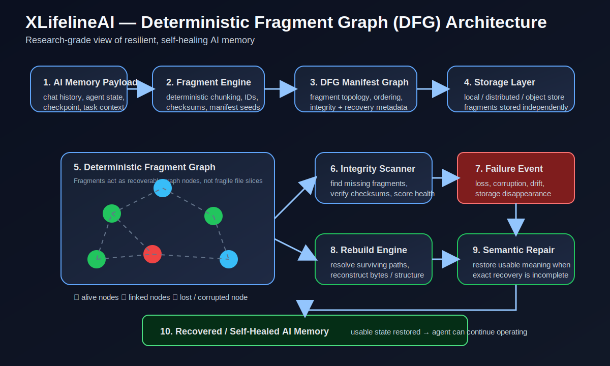
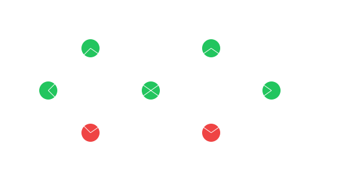
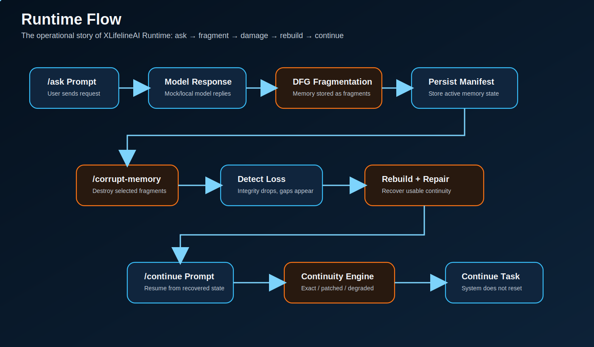

  

<h1 align="center">🤖 XLifelineAI</h1>

<b>Local AI that survives memory loss</b> 
Deterministic Fragment Graphs • Continuity Engine • Self-Healing Runtime

  
  
  

  
  

<i>Failure is inevitable. Collapse is optional.</i>

---

## 🎬 Live Demo

  

---

## ✨ What is XLifelineAI?

A failure-native AI runtime using:

👉 **Deterministic Fragment Graphs (DFG)**

---

## 🧠 Runtime Model

RUN → FAIL → DETECT → REBUILD → CONTINUE  

---

## 🚀 Quickstart

### 1. Clone

git clone https://github.com/raajmandale/XLifelineAI.git  
cd XLifelineAI  

---

### 2. Setup environment

python -m venv .venv  
.venv\Scripts\activate  

---

### 3. Install dependencies

pip install -r requirements.txt  
pip install -e .  

---

### 4. Run demo

python examples/resurrection_demo.py  

---

## 🧪 Output

Fragments created: 8  
Fragments destroyed: 3  
Integrity score: 0.625  
Continuity mode: patched  

---

## 🧠 Fragment Graph

  

- partial context  
- connected memory  
- survivable structure  

---

## 🔗 Recovery

  

- detect loss  
- analyze graph  
- rebuild missing  

---

## ⚙️ Flow

  

Graph → Scan → Repair → Continue  

---

## ♻️ Rebuild

  

---

## 🖥️ Preview

**Simulator**  
docs/simulator/index.html  

**Report**  
docs/demo/resurrection_report.html  

---

## 📂 Structure

xlifeline/  
docs/  
examples/  

---

## 🔍 Core Idea

Traditional  
→ reset  

XLifelineAI  
→ recover  

---

## 🧭 Use Cases

- AI continuity systems  
- long-running agents  
- failure-resilient runtimes  
- memory corruption simulation  

---

## 🗺 Roadmap

v0 — DFG runtime core  
v1 — semantic repair  
v2 — distributed fragments  
v3 — agent-native runtime  

---

## 📊 Status

Research prototype  
DFG continuity model validated  

---

## 👤 Author

Raaj Mandale  
Systems Architect • AI Infrastructure • M-OS • QBAIX  

GitHub: https://github.com/raajmandale  

---

## 📄 License

MIT License  

---

## ⭐ Support

If this idea resonates:

⭐ Star the repo  
🍴 Fork it  
🧪 Break it  
🧠 Build on top of it  

---

## 🔥 Final Thought

AI shouldn’t restart.  
It should recover and continue.

